---
## Author
author:
  name: Ефремова Полина Александровна
  degrees: бакалавр
  orcid:
  email: 1132246726@rudn.ru
  affiliation:
    - name: Российский университет дружбы народов
      country: Российская Федерация
      postal-code: 117198
      city: Москва
      address: ул. Миклухо-Маклая, д. 6
## Title
title: Внешний курс. Блок 1 - Безопасность в сети
subtitle: Внешний курс. Блок 1 - Безопасность в сети
license: CC BY
date: today
date-format: "2026-05-16"
---

# Информация

## Докладчик

:::::::::::::: {.columns align=center}
::: {.column width="70%"}

  * Ефремова Полина Александровна
  * бакалавр
  * Российский университет дружбы народов
  * [1132246726@rudn.ru](mailto:1132246726@rudn.ru)
  * Доклад по теме: Внешний курс Stepik: "Основы кибербезопасности"

:::
::: {.column width="30%"}

:::
::::::::::::::

# Вводная часть

## Актуальность

- сетевые угрозы стали повседневной реальностью;
- пользователи часто доверяют небезопасным соединениям;
- базовые знания о защите данных нужны даже без технической специализации.

## Цель

Показать основные механизмы сетевой защиты и разобрать, как они работают на примере заданий курса.

## Что было изучено

- модель TCP/IP и прикладные протоколы;
- различия HTTP и HTTPS;
- cookies, сессии и персонализация;
- принципы работы TOR;
- основы защиты Wi‑Fi-сетей.

# Основная часть: ключевые задания 1 блока

## Как работает интернет: базовые сетевые протоколы

### 1
UDP - протокол сетевого уровня; TCP - протокол транспортного уровня, IP - протокол сетевого уровня, правильный ответ - HTTPS, это протокол транспортного уровня.

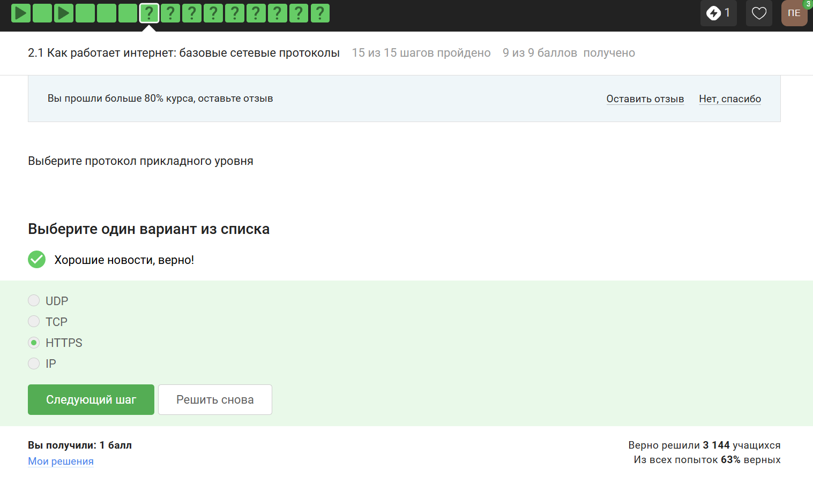{#fig-001 width=70%}

### 2
Протокол TCP - Transmission Control Protocol, он работает на транспортном уровне.

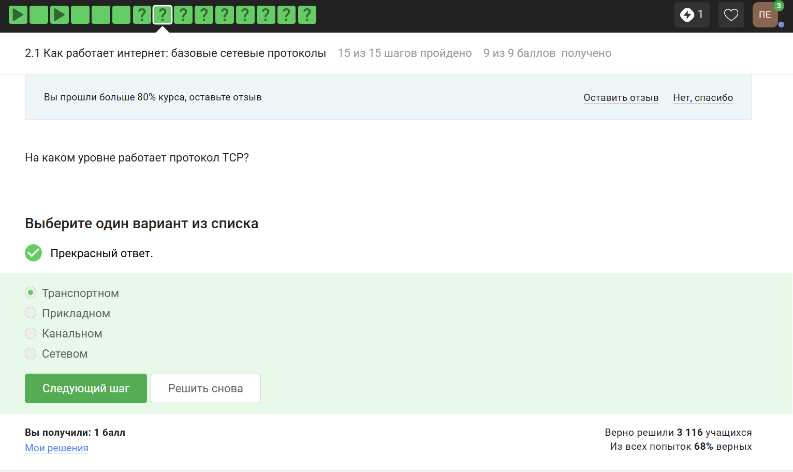{#fig-002 width=70%}

### 4
DNS - Domain Name Server - приложение, предназначенное для ответов на DNS-запросы по соответствующему протоколу.

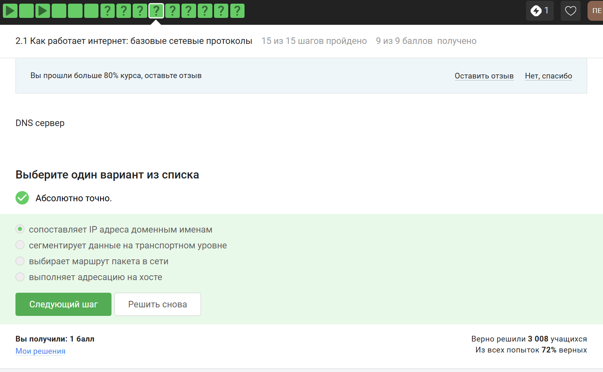{#fig-003 width=70%}

## Персонализация сети

### 6
Протокол http передаёт незашифрованные данные, а протокол https уже будет передавать их в зашифрованном виде.

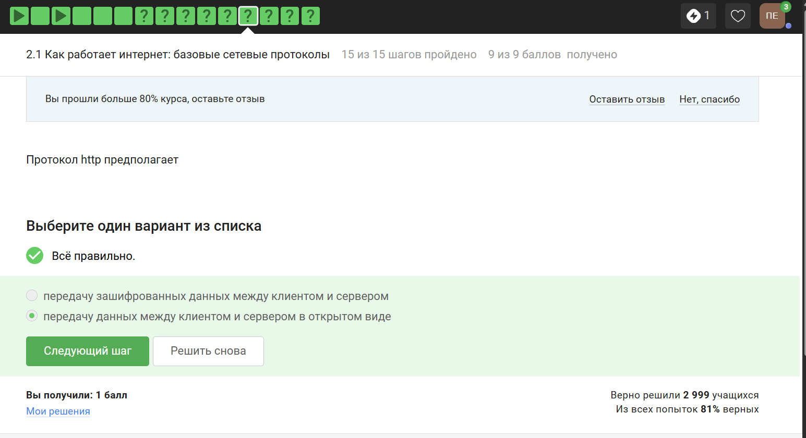{#fig-004 width=70%}

### 8
TLS определяется и клиентом, и сервером, чтобы было возможно подключиться.

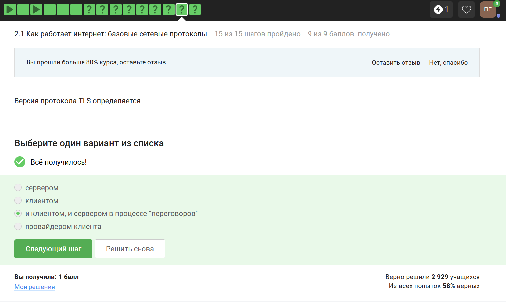{#fig-005 width=70%}

### 10
Куки точно не хранят пароли и IP-адреса, а ID сессии и идентификатор хранят.

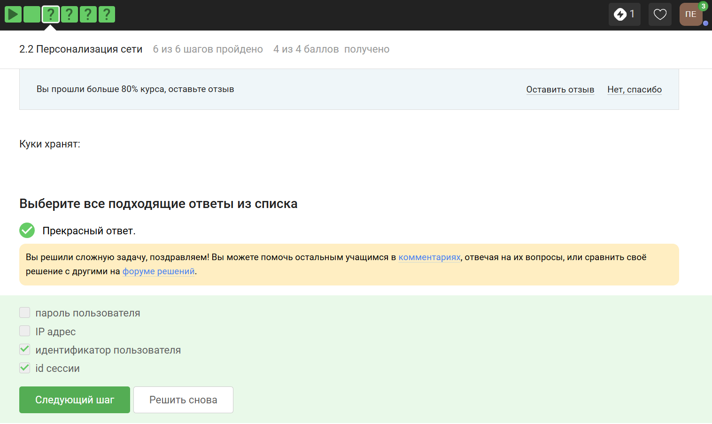{#fig-006 width=70%}

## Браузер TOR. Анонимизация

### 12
Ответ представлен на изображении.

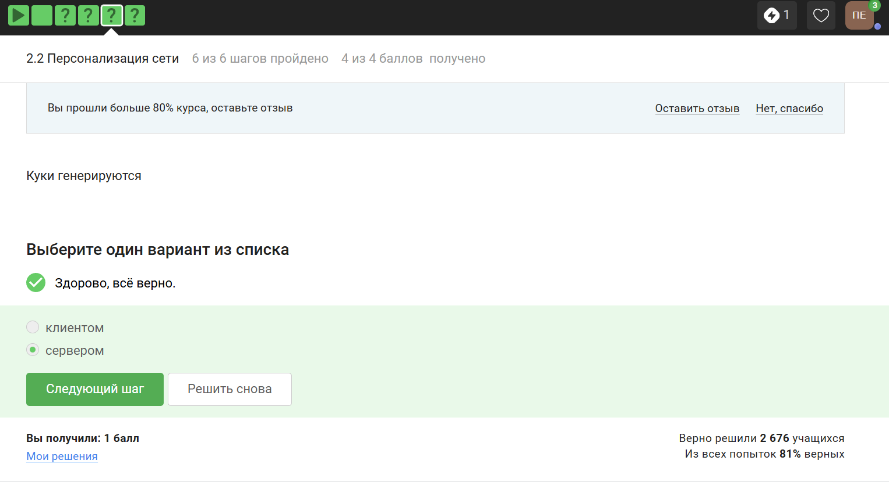{#fig-007 width=70%}

### 14
Необходимо три узла - входной, промежуточный и выходной.

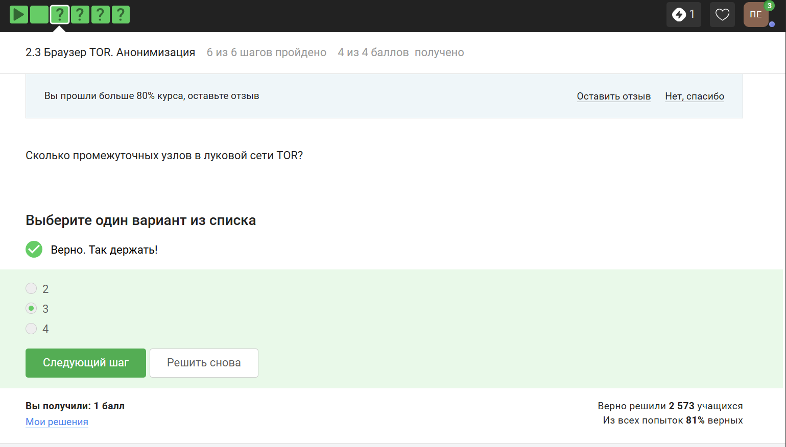{#fig-008 width=70%}

### 16
Отправитель генерирует общий секретный ключ с узлами, через которые идёт передача, то есть со всеми перечисленными.

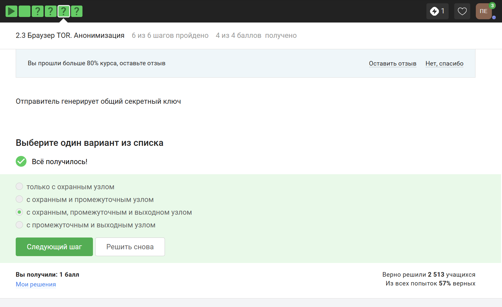{#fig-009 width=70%}

## Беспроводные сети Wi‑Fi

### 18
Выбранное определение наиболее точно.

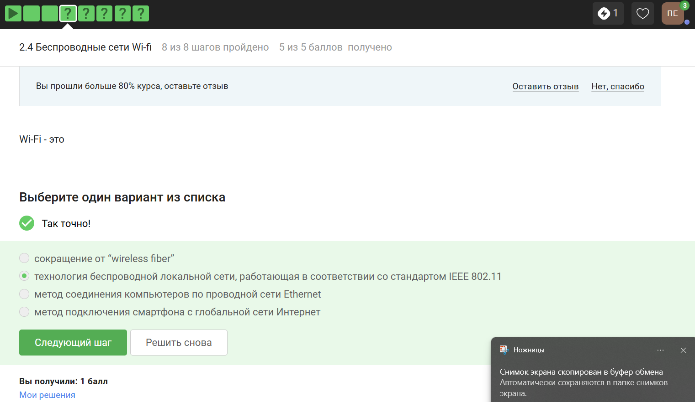{#fig-010 width=70%}

### 20
WEP (Wired Equivalent Privacy) - устаревший и небезопасный метод проверки подлинности.

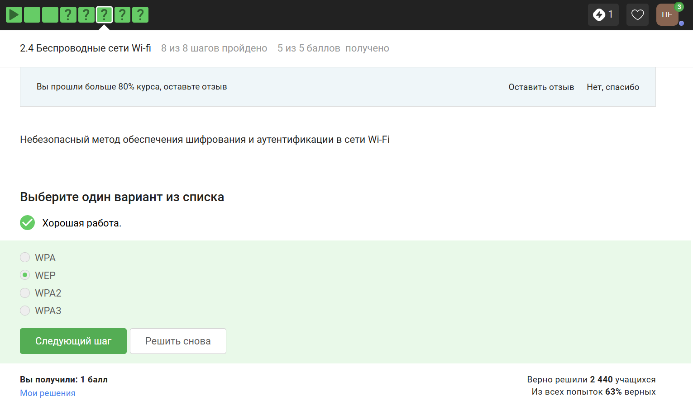{#fig-011 width=70%}

### 22
WPA2 Personal предназначен для личного использования, то есть для домашней сети, Enterprise - для предприятий.

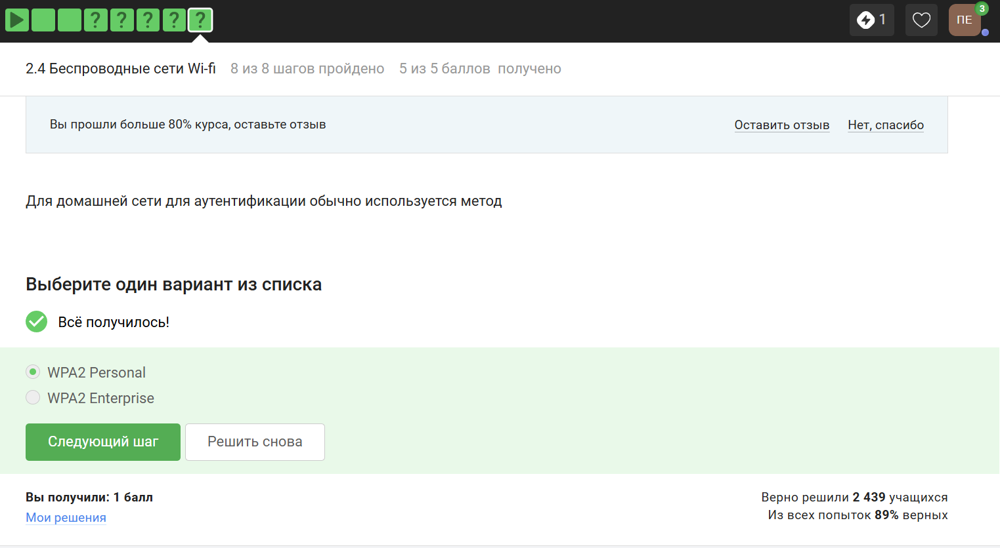{#fig-012 width=70%}

# Итоги

## Ключевые выводы

- интернет работает через набор уровней и протоколов, а не через один «магический» канал;
- HTTPS и TLS важны, потому что защищают передачу данных;
- cookies и сессии удобны, но требуют осторожности;
- TOR помогает скрывать часть сетевой информации;
- Wi‑Fi нужно настраивать с учётом безопасности, а не только удобства.

## Практическая значимость

Из этих заданий хорошо видно, как в реальной жизни появляются риски: через фишинговые сайты, слабые пароли, открытые сети и неверие в базовую гигиену безопасности.

## Вывод

Первый блок курса даёт понятную опору для дальнейшего изучения кибербезопасности и помогает увидеть, где пользователь чаще всего ошибается на практике.
