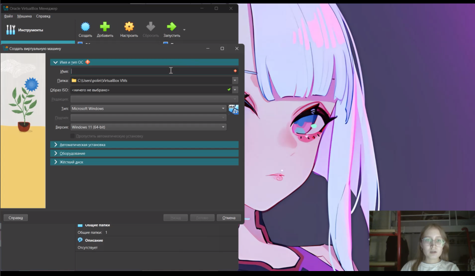
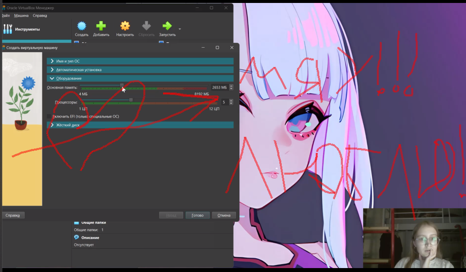
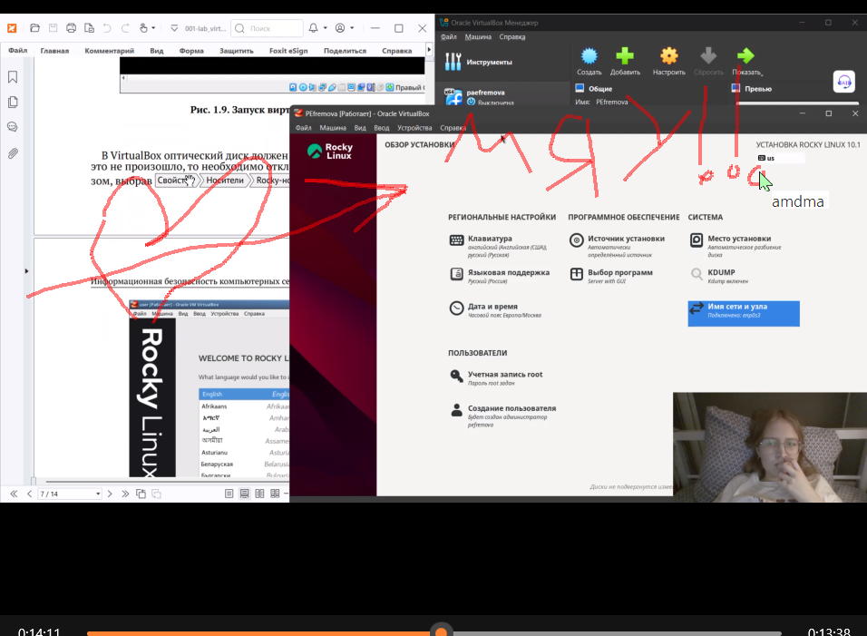
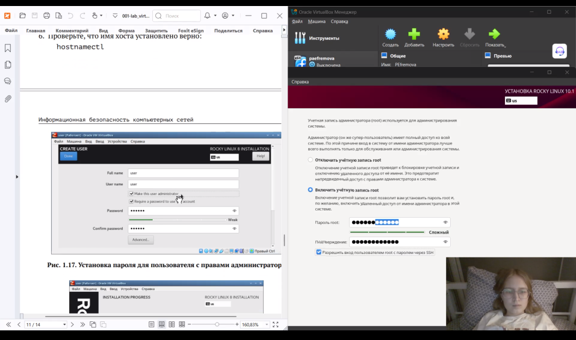
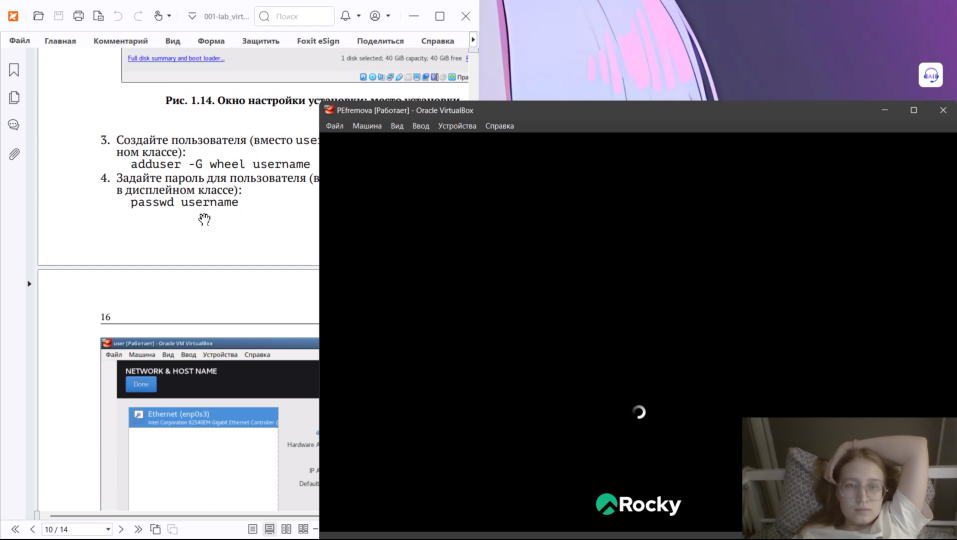

---
## Author
author:
  name: Ефремова Полина Александровна
  email: 1132246726@pfur.ru
  affiliation:
    - name: Российский университет дружбы народов
  group: НКАбд-02-24
  student-id: 1132246726
  url: https://github.com/Paefremova/

## Title
title: "Отчёт по лабораторной работе № 1"
subtitle: "Установка и конфигурация операционной системы на виртуальную машину"
license: "CC BY"
---

# Цель работы

Получить практические навыки установки ОС Linux на виртуальную машину и настройки минимально необходимых сервисов для дальнейшей работы.

# Задание

1. Установить Rocky Linux в VirtualBox с заданными параметрами (RAM, диск, тип ОС).
2. Настроить имя хоста и пользователя согласно соглашению об именовании.
3. Установить дополнения гостевой ОС.
4. Выполнить домашнее задание: проанализировать загрузку системы по `dmesg` и извлечь требуемые параметры.
5. Ответить на контрольные вопросы.

# Теоретическое введение

Виртуализация позволяет запускать гостевую ОС внутри хост-системы, изолируя окружение и обеспечивая воспроизводимость настроек. VirtualBox предоставляет средства управления виртуальной машиной: выделение ресурсов, подключение ISO-образов, сетевые режимы и снапшоты.

Установка Linux обычно выполняется с загрузочного ISO-образа. На этапе установки задаются параметры локали, раскладки, сети, разметки диска, пакетов и учётных записей. После установки рекомендуется установить Guest Additions для корректной работы драйверов устройств и интеграции с хостом.

Команда `dmesg` выводит журнал сообщений ядра Linux, позволяя получить сведения о железе, параметрах загрузки, типе файловой системы и гипервизоре.

# Выполнение лабораторной работы

## Подготовка каталога и запуск VirtualBox

1. Перешла в рабочий каталог и создала директорию с логином:

```bash
cd /var/tmp
mkdir /var/tmp/`id -un`
```

2. Запустила VirtualBox и проверила путь хранения виртуальных машин.

{#fig-vbox-path width=70%}

## Создание виртуальной машины

1. Создала новую ВМ с типом Linux/RedHat (64-bit), задала имя равное логину.
2. Выделила 2048 МБ памяти.
3. Создала динамический VDI-диск на 40 ГБ.
4. Подключила ISO-образ Rocky Linux в разделе «Носители».

{#fig-vm-create width=70%}

## Установка ОС

1. Запустила ВМ, выбрала английский язык интерфейса.
2. Настроила часовой пояс и раскладку (английская по умолчанию, добавлена русская).
3. В разделе Software Selection выбрала `Server with GUI` и `Development Tools`.
4. Отключила KDUMP.
5. Включила сеть и задала имя узла вида `user.localdomain`.
6. Установила пароль `root` и создала пользователя с правами администратора.

{#fig-rocky-install width=70%}

После завершения установки приняла лицензию и перезагрузила ВМ.

## Установка Guest Additions

1. В меню VirtualBox подключила образ дополнений гостевой ОС.
2. Запустила установку и перезагрузила ВМ после завершения.

{#fig-guest-additions width=70%}

## Проверка имени пользователя и хоста

Если имя пользователя/хоста не соответствовало соглашению об именовании, скорректировала параметры:

```bash
su -
adduser -G wheel username
passwd username
hostnamectl set-hostname username
hostnamectl
```

## Домашнее задание: анализ `dmesg`

Команда для просмотра:

```bash
dmesg | less
```

По журналу загрузки определены параметры:

| Параметр | Значение (из `dmesg`) |
|---|---|
| Версия ядра | 5.14.x (строка `Linux version ...`) |
| Частота CPU | ~3200 MHz (строка `Detected Mhz processor`) |
| Модель CPU | строка `CPU0: ...` |
| Доступная RAM | строка `Memory available` |
| Тип гипервизора | `Hypervisor detected: KVM/VirtualBox` |
| ФС корневого раздела | `xfs` или `ext4` |
| Последовательность монтирования | список из сообщений `Mounted ...` |

{#fig-dmesg width=70%}

# Контрольные вопросы

1. **Какую информацию содержит учётная запись пользователя?**
   Учётная запись хранит имя пользователя, UID/GID, домашний каталог, оболочку, а также дополнительные группы и параметры аутентификации.

2. **Команды терминала и примеры:**

   - Справка по команде: `man ls`, `ls --help`.
   - Перемещение по ФС: `cd /home/guest`.
   - Просмотр содержимого каталога: `ls -la`.
   - Определение объёма каталога: `du -sh /var/log`.
   - Создание/удаление каталогов/файлов: `mkdir dir1`, `rmdir dir1`, `touch file`, `rm file`.
   - Задание прав: `chmod 640 file`, `chmod 755 dir`.
   - История команд: `history`.

3. **Что такое файловая система? Примеры.**
   Файловая система — способ организации хранения данных на носителе. Примеры: `ext4` (журнальная, популярна в Linux), `xfs` (журнальная, эффективна на больших объёмах), `btrfs` (копирование-при-записи, снапшоты).

4. **Как посмотреть подмонтированные файловые системы?**
   Команды: `mount`, `findmnt`, `cat /proc/mounts`.

5. **Как удалить зависший процесс?**
   Найти PID (`ps aux`, `top`), затем выполнить `kill PID` или `kill -9 PID`.

# Выводы

Установлена и настроена виртуальная машина с Rocky Linux, настроены пользователь и имя хоста, установлены дополнения гостевой ОС. Освоены базовые команды работы с системой и анализ загрузки через `dmesg`.

# Список литературы{.unnumbered}

::: {#refs}
:::
