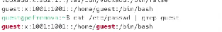
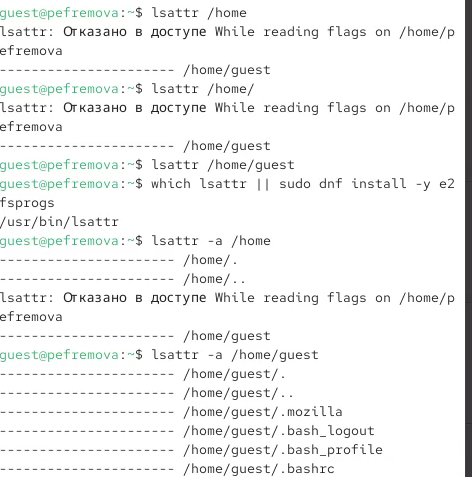
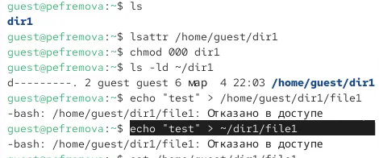

---
## Author
author:
  name: Ефремова Полина Александровна
  email: 1132246726@pfur.ru
  affiliation:
    - name: Российский университет дружбы народов
  group: НКАбд-02-24
  student-id: 1132246726
  url: https://github.com/Paefremova/

## Title
title: "Отчёт по лабораторной работе № 2"
subtitle: "Дискреционное разграничение прав в Linux. Основные атрибуты"
license: "CC BY"
---

# Цель работы

Получить практические навыки работы с атрибутами файлов в Linux и закрепить основы дискреционного разграничения доступа.

# Задание

1. Создать пользователя `guest` и выполнить набор команд для изучения UID/GID, групп и содержимого `/etc/passwd`.
2. Проверить права и расширенные атрибуты директорий в `/home`.
3. Создать директорию `dir1`, изменить права и исследовать поведение операций над файлами.
4. Заполнить таблицы 2.1 и 2.2.

# Теоретическое введение

Дискреционная модель доступа (DAC) в Linux основана на правах владельца, группы и остальных пользователей. Для файлов и директорий используются атрибуты `r` (чтение), `w` (запись), `x` (выполнение/доступ). Для директорий `x` означает возможность входа в каталог и доступа к объектам, а `r` — возможность просмотра списка.

Команды `chmod`, `chown`, `ls -l` позволяют управлять и контролировать права. Дополнительно используются расширенные атрибуты, видимые через `lsattr`, но в рамках этой работы основное внимание уделяется стандартным.

# Выполнение лабораторной работы

## Создание пользователя и первичная диагностика

1. Создала пользователя `guest` и задала пароль:

```bash
useradd guest
passwd guest
```

2. Вошла под пользователем `guest`, проверила текущую директорию и имя пользователя:

```bash
pwd
whoami
id
groups
```

3. Проверила запись в `/etc/passwd` и `uid/gid`:

```bash
cat /etc/passwd | grep guest
```

{#fig-lab02-id width=70%}

## Анализ прав в `/home`

1. Просмотрела права на поддиректории:

```bash
ls -l /home/
```

2. Проверила расширенные атрибуты:

```bash
lsattr /home
```

{#fig-lab02-home width=70%}

## Работа с каталогом dir1

1. Создала каталог и проверила права:

```bash
mkdir dir1
ls -l
lsattr dir1
```

2. Сняла права и попыталась создать файл:

```bash
chmod 000 dir1
echo "test" > /home/guest/dir1/file1
ls -l /home/guest/dir1
```

Создание файла не удалось, так как отсутствуют права на запись и доступ к директории.

{#fig-lab02-deny width=70%}

## Таблица 2.1: установленные права и разрешённые действия

| Права директории | Права файла     | Создание файла | Удаление файла | Запись в файл | Чтение файла | Смена директории | Просмотр файлов в директории | Переименование файла | Смена атрибутов файла |
| ---------------- | --------------- | -------------- | -------------- | ------------- | ------------ | ---------------- | ---------------------------- | -------------------- | --------------------- |
| d(000)           | (000)           | -              | -              | -             | -            | -                | -                            | -                    | -                     |
| d--x------ (100) | (000)           | -              | -              | -             | -            | +                | -                            | -                    | -                     |
| d-w------- (200) | (000)           | -              | -              | -             | -            | -                | -                            | -                    | -                     |
| d-wx------ (300) | (000)           | +              | +              | -             | -            | +                | -                            | +                    | -                     |
| dr-------- (400) | r-------- (400) | -              | -              | -             | +            | -                | +                            | -                    | -                     |
| dr-x------ (500) | r-x------ (500) | -              | -              | -             | +            | +                | +                            | -                    | -                     |
| drw------- (600) | rw------- (600) | -              | -              | +             | +            | -                | -                            | -                    | +                     |
| drwx------ (700) | rwx------ (700) | +              | +              | +             | +            | +                | +                            | +                    | +                     |


## Таблица 2.2: минимальные права для операций

| Операция | Минимальные права на директорию | Минимальные права на файл |
|---|---|---|
| Создание файла | `wx` | — |
| Удаление файла | `wx` | — |
| Чтение файла | `x` | `r` |
| Запись в файл | `x` | `w` |
| Переименование файла | `wx` | — |
| Создание поддиректории | `wx` | — |
| Удаление поддиректории | `wx` | `wx` |

# Выводы

Изучены базовые права файлов и директорий в Linux. Практически проверено влияние атрибутов `r/w/x` на операции создания, удаления и доступа к файлам. Сформированы таблицы разрешённых действий и минимальных прав.

# Список литературы{.unnumbered}

[Лабораторная работа 2](https://esystem.rudn.ru/pluginfile.php/3096707/mod_resource/content/6/002-lab_discret_attr.pdf)


::: {#refs}
:::
