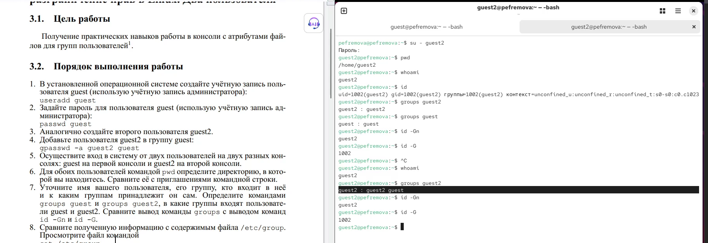
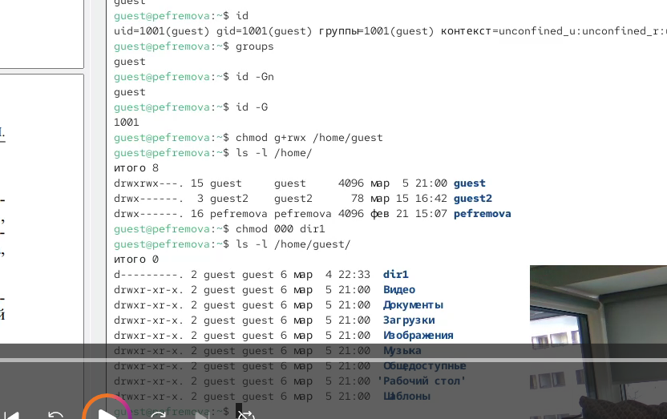

---
## Author
author:
  name: Ефремова Полина Александровна
  email: 1132246726@pfur.ru
  affiliation:
    - name: Российский университет дружбы народов
  group: НКАбд-02-24
  student-id: 1132246726
  url: https://github.com/Paefremova/

## Title
title: "Лабораторная работа № 3"
subtitle: "Дискреционное разграничение прав в Linux. Два пользователя"
license: CC BY
date: today
date-format: "YYYY-MM-DD" # Example: 2025-09-06
format:
  revealjs:
    slide-level: 2
  beamer:
    slide-level: 2
  pptx:
    slide-level: 2
---

# Информация

## Докладчик

:::::::::::::: {.columns align=center}
::: {.column width="70%"}

  * Ефремова Полина Александровна
  * студент группы НКАбд-02-24
  * ст.б №1132246726
  * Российский университет дружбы народов
  * [1132246726@pfur.ru](mailto:1132246726@pfur.ru)
  * <https://github.com/Paefremova/>

:::
::: {.column width="30%"}

:::
::::::::::::::

# Цель и задачи

## Цель

Изучить групповое разграничение прав на практике.

## Задание

- Создать guest и guest2
- Добавить guest2 в группу guest
- Сравнить группы и идентификаторы
- Изменить права и заполнить таблицы 3.1 и 3.2

# Теоретические сведения

## Ключевые понятия

- Групповые права применяются при членстве
- newgrp активирует группу
- Права директорий управляют доступом к файлам

# Выполнение работы

## Основные шаги

- Создание пользователей и групп
- newgrp guest
- chmod g+rwx /home/guest
- Проверка операций как guest2
- Заполнение таблиц

## Иллюстрации

{fig-alt="Скриншот ключевого шага выполнения"}

{fig-alt="Скриншот ключевого шага выполнения"}

# Результаты и выводы

## Результаты

- Проверено влияние групповых прав
- Сформированы таблицы 3.1 и 3.2

## Выводы

- Цель работы достигнута.
- Получены практические навыки по теме лабораторной.
