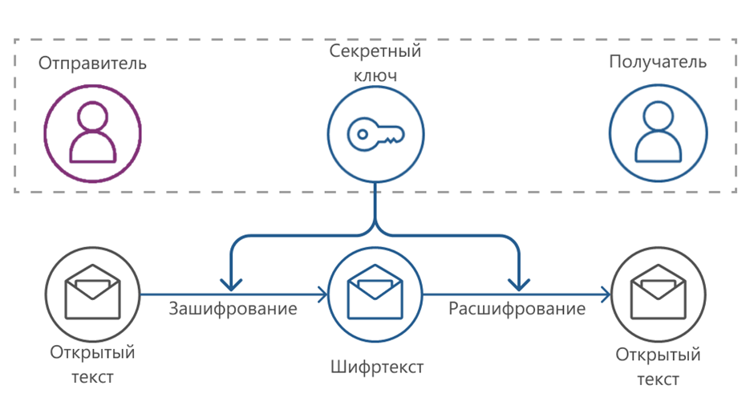
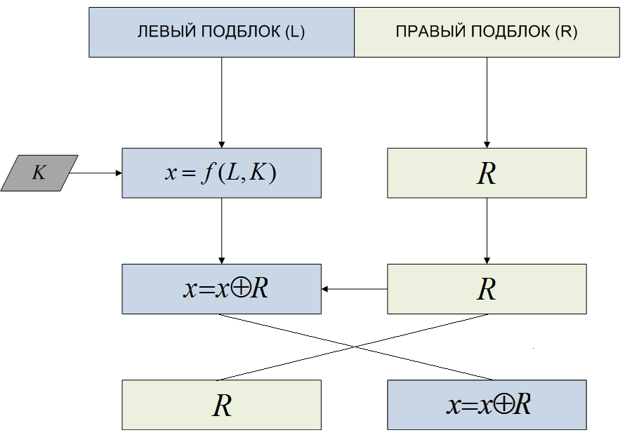

---
## Author
author:
  name:  Ефремова Полина Александровна
  degrees: bachelor
  orcid: 
  email: 1132246726@rudn.ru
  affiliation:
    - name: Российский университет дружбы народов
      country: Российская Федерация
      postal-code: 
      city: Москва
      address: ул. Миклухо-Маклая, д. 6

## Title
title: "Общие вопросы шифрования"
subtitle: "Реферат"
license: "CC BY"
---

# Цель работы

Ознакомиться с основными понятиями и методами шифрования, рассмотреть классификацию криптографических алгоритмов и их применение для обеспечения информационной безопасности.

# Введение

Шифрование является одним из краеугольных камней современной информационной безопасности.
В условиях повсеместного распространения цифровых коммуникаций защита данных от несанкционированного доступа, подделки и перехвата приобретает первостепенное значение.
Криптография как наука о методах обеспечения конфиденциальности и целостности данных прошла долгий путь от простейших подстановочных шифров до сложнейших асимметричных алгоритмов.

Настоящий реферат посвящён общим вопросам шифрования: задачам, которые решает криптография, основным видам и принципам построения шифров, а также историческому контексту их развития.
Понимание этих основ необходимо для изучения более прикладных аспектов информационной безопасности — защиты сетевых соединений, хранения паролей, организации защищённых каналов связи.

# Основные понятия

**Криптография** — наука о методах обеспечения конфиденциальности, целостности данных, аутентификации и невозможности отказа от авторства.

**Шифрование** — процесс преобразования открытого текста (plaintext) в зашифрованный (ciphertext) с помощью криптографического алгоритма и ключа.

**Ключ** — параметр, управляющий работой алгоритма шифрования и определяющий конкретное преобразование открытого текста в шифртекст.

**Симметричное шифрование** — схема, при которой для шифрования и расшифрования используется один и тот же ключ или ключи, тривиально выводимые друг из друга.

**Асимметричное шифрование** — схема с парой математически связанных ключей: открытым (public key) и закрытым (private key), при которой знание одного ключа не позволяет практически вычислить другой.

**Блочный шифр** — алгоритм, обрабатывающий данные фиксированными блоками (обычно 64 или 128 бит).

**Поточный шифр** — алгоритм, генерирующий псевдослучайный поток битов (гамму), который побитово складывается с открытым текстом по модулю два.

# Задачи криптографии

Современная криптография решает четыре ключевые задачи информационной безопасности:

**Конфиденциальность** обеспечивает невозможность прочтения сообщения посторонними лицами.
Даже если злоумышленник перехватит зашифрованные данные, он не сможет восстановить исходный открытый текст без знания ключа.

**Целостность** гарантирует, что данные не были изменены в процессе передачи или хранения.
Для этого применяются криптографические хэш-функции и коды аутентификации сообщений (MAC).

**Аутентификация** позволяет убедиться в подлинности отправителя сообщения или источника данных.
Механизмы аутентификации основаны как на симметричных, так и на асимметричных схемах.

**Невозможность отказа от авторства** (non-repudiation) исключает возможность для отправителя отрицать факт отправки сообщения.
Это свойство реализуется с помощью электронной цифровой подписи на основе асимметричной криптографии.

# Принцип Керкхоффса

Одним из фундаментальных принципов криптографии является принцип Керкхоффса, сформулированный нидерландским криптографом Огюстом Керкхоффсом в 1883 году.
Согласно этому принципу, надёжность криптографической системы не должна основываться на секретности самого алгоритма — система должна оставаться безопасной, даже если все её компоненты, кроме ключа, стали известны противнику 

Практическое следствие данного принципа состоит в том, что современные криптографические алгоритмы публикуются в открытом доступе и проходят многолетний независимый криптоанализ.
Это позволяет всему криптографическому сообществу выявлять слабые места ещё до широкого применения алгоритма.

# Виды шифрования

## Симметричное шифрование

При симметричном шифровании отправитель и получатель используют один и тот же секретный ключ ([рис. @fig-001]).
Типичная длина ключа составляет 128–256 бит.
Главное преимущество симметричных алгоритмов — высокая скорость работы.
Главный недостаток — необходимость безопасной передачи ключа между сторонами до начала обмена сообщениями.

{#fig-001 width=70%}

К наиболее известным симметричным алгоритмам относятся DES, 3DES, AES (Rijndael), ГОСТ 28147-89 и его преемник «Кузнечик».

## Асимметричное шифрование

При асимметричном шифровании используется пара ключей: открытый ключ доступен всем желающим и применяется для шифрования, тогда как закрытый ключ хранится в тайне и используется для расшифрования.
Типичные длины ключей составляют 1024–4096 бит для операций в конечном поле (RSA) и около 256 бит для операций на эллиптической кривой (ECC).

Асимметричная криптография существенно медленнее симметричной, поэтому на практике её используют преимущественно для обмена сеансовыми ключами и реализации электронной цифровой подписи.

# Симметричные шифры

## Шифры подстановки

В шифрах подстановки каждый символ или группа символов открытого текста заменяется другим символом или группой по определённому правилу.

**Шифр Цезаря** — простейший моноалфавитный шифр подстановки, в котором каждая буква алфавита сдвигается на фиксированное число позиций [@web:ivanov_firewall].
Например, при сдвиге на три позиции буква «А» заменяется на «Г», «Б» — на «Д» и т.д.
Шифр Цезаря легко взламывается методом частотного анализа: в любом достаточно длинном тексте одни буквы встречаются значительно чаще других, и это соотношение сохраняется после простой подстановки.

**Шифр Виженера** — полиалфавитный шифр, использующий ключевое слово.
Каждая буква открытого текста шифруется со сдвигом, определяемым соответствующей буквой ключа.
Это существенно усложняет частотный анализ, однако и данный шифр не является стойким при длинных шифртекстах.

## Шифры перестановки

В шифрах перестановки символы открытого текста не заменяются, а переставляются в определённом порядке.
При простой перестановке текст разбивается на блоки и записывается в матрицу, после чего считывается по столбцам в порядке, заданном ключом.

## Машина Энигма и вклад Алана Тьюринга

Одной из наиболее известных криптографических машин в истории является немецкая шифровальная машина «Энигма», активно использовавшаяся в годы Второй мировой войны.
«Энигма» реализовывала полиалфавитный шифр с несколькими роторами, обеспечивая огромное число возможных начальных конфигураций.

Взлом «Энигмы» стал одним из величайших достижений в истории криптоанализа.
В британском Блетчли-парке группа под руководством Алана Тьюринга создала электромеханические устройства — «Бомбы» — позволявшие перебирать возможные настройки роторов.
Успех этой работы оказал значительное влияние на ход Второй мировой войны и дал толчок развитию вычислительной техники.

# Блочные шифры и режимы шифрования

## Сеть Фейстеля

Большинство современных блочных шифров построены на основе сети Фейстеля ([рис. @fig-002]).
В этой конструкции входной блок делится на две половины; в каждом раунде правая половина обрабатывается раундовой функцией с использованием подключа и складывается по XOR с левой; затем половины меняются местами.
Важное свойство сети Фейстеля состоит в том, что для расшифрования используется тот же алгоритм, что и для шифрования, — достаточно применить подключи в обратном порядке.

{#fig-002 width=50%}

## Алгоритм DES

DES (Data Encryption Standard) — блочный симметричный шифр, разработанный в 1970-х годах и принятый в качестве федерального стандарта США.
DES основан на сети Фейстеля и характеризуется размером блока 64 бита, размером ключа 56 бит и 16 раундами преобразований.
Из-за малой длины ключа DES более не считается безопасным: в настоящее время его можно взломать перебором за приемлемое время.
В качестве замены был разработан алгоритм AES с длиной блока 128 бит и длиной ключа 128, 192 или 256 бит.

## Режимы работы блочных шифров

Блочный шифр сам по себе определяет лишь преобразование одного блока данных.
Для шифрования произвольных сообщений необходим режим работы — схема, определяющая, как шифр применяется к последовательности блоков.

| Режим | Полное название | Особенности |
|-------|-----------------|-------------|
| ECB | Electronic Codebook | Блоки шифруются независимо; одинаковые блоки дают одинаковый шифртекст |
| CBC | Cipher Block Chaining | Каждый блок перед шифрованием складывается по XOR с предыдущим шифртекстом |
| CFB | Cipher Feedback | Блочный шифр используется как поточный; шифртекст предыдущего блока подаётся на вход шифра |
| OFB | Output Feedback | Гамма генерируется независимо от данных; ошибки не распространяются |
| CTR | Counter | Шифруется счётчик; возможна параллельная обработка блоков |

: Режимы работы блочных шифров {#tbl-modes}

Режим ECB является наименее безопасным: одинаковые блоки открытого текста дают одинаковые блоки шифртекста, что позволяет выявлять структуру данных даже без знания ключа.
Остальные режимы (CBC, CFB, OFB, CTR) устраняют этот недостаток за счёт «сцепления» блоков или использования вектора инициализации (IV).

# Поточные шифры

Поточные шифры шифруют данные побитово или побайтово, генерируя псевдослучайную последовательность (гамму), зависящую от ключа.
Открытый текст складывается с гаммой по модулю два, что даёт шифртекст; обратная операция — расшифрование — выполняется аналогично.

**Шифр Вернама** (одноразовый блокнот, One-Time Pad) является теоретически абсолютно стойким поточным шифром.
Ключ (гамма) должен быть истинно случайным, по длине не меньше шифруемого сообщения и использоваться строго однократно.
При соблюдении этих условий шифртекст не несёт никакой информации об открытом тексте — любой открытый текст той же длины может быть получен из шифртекста подбором соответствующего ключа.
Однако практическое применение шифра Вернама крайне ограничено именно из-за требования однократного использования ключа той же длины, что и сообщение.

# Заключение

Шифрование является важнейшим инструментом обеспечения информационной безопасности, позволяющим решать задачи конфиденциальности, целостности, аутентификации и невозможности отказа от авторства.
Криптографические алгоритмы прошли долгий путь от простых подстановочных шифров до сложных блочных и асимметричных конструкций.

Ключевыми выводами настоящего реферата являются следующие.
Принцип Керкхоффса определяет, что безопасность системы должна основываться исключительно на секретности ключа, но не алгоритма.
Симметричные алгоритмы обеспечивают высокую скорость шифрования, но требуют защищённого канала для передачи ключа.
Асимметричные алгоритмы решают проблему распределения ключей, но значительно медленнее симметричных.
Выбор режима работы блочного шифра существенно влияет на безопасность системы в целом: небезопасный режим ECB не должен применяться для шифрования реальных данных.
Понимание этих основ необходимо для грамотного проектирования защищённых информационных систем.

# Список литературы{.unnumbered}

1. [Медведовский И.Д., Семьянов П.В., Платонов В.В. Атака через Internet. — НПО «Мир и семья-95», 1997.](http://bugtraq.ru/library/books/attack1/index.html) 

2. [Медведовский И.Д., Семьянов П.В., Леонов Д.Г. Атака на Internet. — Издательство ДМК, 1999.](http://bugtraq.ru/library/books/attack/index.html) 

3. [Запечников С. В. и др. Информационная безопасность открытых систем. Том 1. — М.: Горячая линия — Телеком, 2006.] 

4. [Гамаюнов Д. Введение в информационную безопасность. Типы уязвимостей.](https://esystem.rudn.ru/mod/page/view.php?id=1357896)

5. [Гамаюнов Д. Практические аспекты сетевой безопасности. Вводная лекция. Сетевая безопасность. Стек протоколов TCP/IP.](https://esystem.rudn.ru/mod/page/view.php?id=1357897) 

6. [Иванов В. Практические аспекты сетевой безопасности. Межсетевые экраны.](https://esystem.rudn.ru/mod/page/view.php?id=1357898) 

7. [Гамаюнов Д. Практические аспекты сетевой безопасности. Системы обнаружения и фильтрации компьютерных атак (IDS/IPS).](https://esystem.rudn.ru/mod/page/view.php?id=1357899)

8. [Сахаров В. Практические аспекты сетевой безопасности. Контроль нормального поведения приложений. Security Enhanced Linux (SELinux).](https://esystem.rudn.ru/mod/page/view.php?id=1357900)

::: {#refs}
:::
